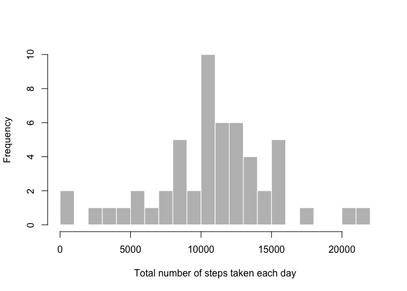
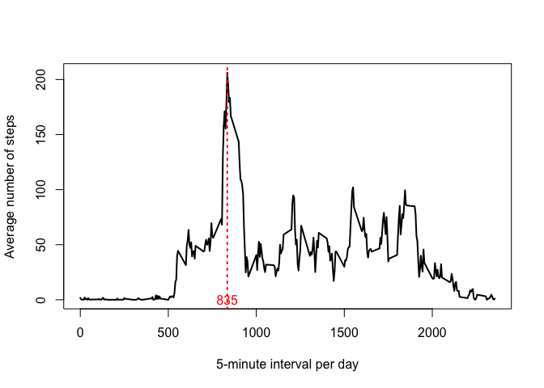
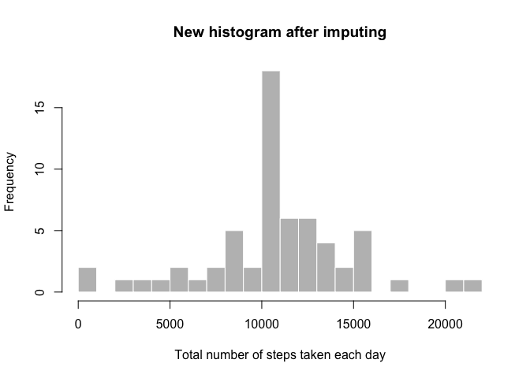
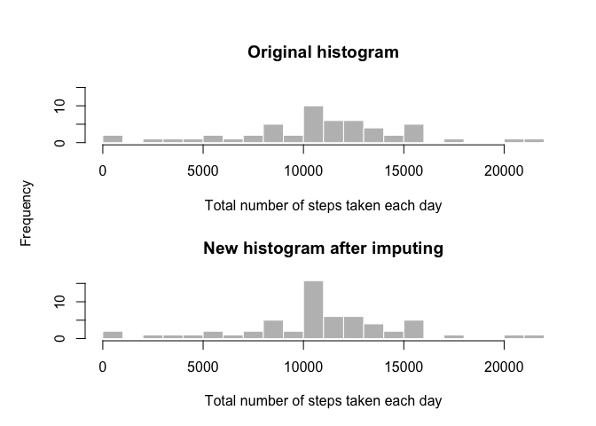
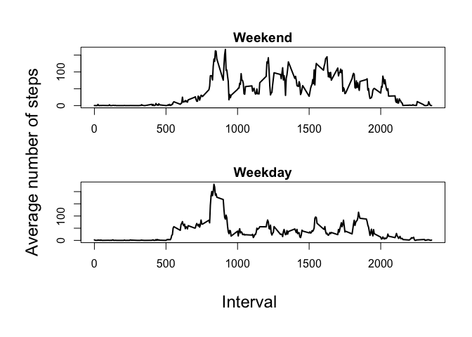

# Reproducible Research: Peer Assessment 1
Jacky Pan  


## Loading and preprocessing the data

```r
## Check if the dataset exists
if(!file.exists("activity.csv")){
        url = "https://d396qusza40orc.cloudfront.net/repdata%2Fdata%2Factivity.zip"
        download.file(url, "activity.zip", method = "curl")
}
```

* Step 1. Using `read.csv()` to load the data

```r
unzip("activity.zip")
data <- read.csv("activity.csv", header = TRUE, na.strings = "NA")
```

* Step 2. Transform the variable `date` from string object to date object.

```r
data$date <- as.Date(data$date)
```

## What is mean total number of steps taken per day?
To answer this question, we first make a histogram to show the total number of steps taken each day.

```r
# 1. Grouping the number of steps by day
steps_per_day <- aggregate(steps ~ date, data = data , sum)

# 2. Make a histogram of total number of steps each day
hist(steps_per_day$steps, col = "gray", border = FALSE,
     xlab = "Total number of steps taken each day", main = NULL, breaks = 20)
```



And then report the descriptive statistics regarding **Mean** and **Median** of total number of steps taken per day.

* Mean total number of steps taken per day: 1.076619\times 10^{4}
* Median total number of steps taken per day: 1.0765\times 10^{4}

※ Reference: Code to derive **Mean** and **Median**

```r
mean(steps_per_day$steps)
median(steps_per_day$steps)
```

## What is the average daily activity pattern?
To show the pattern, we make a time series plot of the 5-minute interval (x-axis) and the average number of steps taken, averaged across all days (y-axis)

```r
ave_daily_pat <- aggregate(steps ~ interval, data = data ,FUN = mean)
with(ave_daily_pat, plot(interval, steps, type = "l", lwd = 2, xlab = "5-minute interval per day", ylab = "Average number of steps"))
abline(v = ave_daily_pat[which.max(ave_daily_pat$steps),"interval"], lwd = 2, lty = 3,col = "red")
text(ave_daily_pat[which.max(ave_daily_pat$steps),"interval"], 0, "835", col = "red")
```



and the **835** of 5-minute interval contains the maximun number of steps.

※ Reference: Code to derive maximum number of steps

```r
ave_daily_pat[which.max(ave_daily_pat$steps),"interval"]
```

## Imputing missing values
Note that there are a number of days/intervals where there are missing values (coded as `NA`). The presence of missing days may introduce bias into some calculations or summaries of the data. Therefore, We list down the strategy to deal with (**impute**) missing values.

* Step 1. Calculate and report the total number of missing values in the dataset (i.e. the total number of rows with NAs)

```r
sum(is.na(data$steps))
```

```
## [1] 2304
```

* Step 2. Create a new dataset `imputeData` 

```r
imputeData <- data
```

* Step 3. Impute the missing values into the `mean of 5-minute interval`

```r
for (i in c(1:length(ave_daily_pat$interval))) {
        imputeData[(imputeData$interval == ave_daily_pat$interval[i] & is.na(imputeData$steps) ), ]$steps = ave_daily_pat$steps[i]        
}
```

To show the effect of imputing missing values, We make a histogram of the total number of steps taken each day like previous part 


```r
# 1. Grouping the number of steps by day
steps_per_day_impute <- aggregate(steps ~ date, data = imputeData , sum)

# 2. Make a histogram of total number of steps each day
hist(steps_per_day_impute$steps, col = "gray", border = FALSE,
     xlab = "Total number of steps taken each day", main ="New histogram after imputing", breaks = 20)
```



and Calculate and report the mean and median total number of steps taken per day.

* Mean total number of steps taken per day: 1.076619\times 10^{4}
* Median total number of steps taken per day: 1.076619\times 10^{4}


```r
# Make comparison of mean and median value between original data and imputed data
compare <- matrix(c(mean(steps_per_day$steps),median(steps_per_day$steps) ,mean(steps_per_day_impute$steps), median(steps_per_day_impute$steps)), nrow = 2, ncol = 2)
rownames(compare) <- c("Mean", "Median")
colnames(compare) <- c("Original", "Imputed")
# Make xtable html display
library(xtable)
xt <- xtable(compare)
print(xt, type = "html")
```

<!-- html table generated in R 3.2.4 by xtable 1.8-2 package -->
<!-- Tue Apr 12 17:08:36 2016 -->
<table border=1>
<tr> <th>  </th> <th> Original </th> <th> Imputed </th>  </tr>
  <tr> <td align="right"> Mean </td> <td align="right"> 10766.19 </td> <td align="right"> 10766.19 </td> </tr>
  <tr> <td align="right"> Median </td> <td align="right"> 10765.00 </td> <td align="right"> 10766.19 </td> </tr>
   </table>


The result shows that **median value** is close to the **mean value**. The reason is that we use mean value to replace the missing value. The histogram plot shows the increased central tendency of the overall total number of steps taken each day, after imputed.

```r
par(mfrow = c(2,1), mar = c(4,3,4,1), oma = c(1,2,1,1))
hist(steps_per_day$steps, col = "gray", border = FALSE, freq = TRUE,
     xlab = "Total number of steps taken each day", main = "Original histogram", breaks = 20, ylim = c(0,15))
hist(steps_per_day_impute$steps, col = "gray", border = FALSE, freq = TRUE,
     xlab = "Total number of steps taken each day", main = "New histogram after imputing", breaks = 20, ylim = c(0,15))
mtext("Frequency", side = 2, outer = TRUE)
```



※ Reference: Code to derive **Mean** and **Median**

```r
mean(steps_per_day_impute$steps)
median(steps_per_day_impute$steps)
```


## Are there differences in activity patterns between weekdays and weekends?
To answer this question, we first create new column variable `weekdays` in our imputed dataset. 


```r
imputeData$weekdays <- weekdays(imputeData$date, abbreviate = TRUE)
imputeData[imputeData$weekdays %in% c("Sat", "Sun"), ]$weekdays <- "weekend"
imputeData[imputeData$weekdays != "weekend", ]$weekdays <- "weekday"
imputeData$weekdays <- as.factor(imputeData$weekdays)
```

Then we make a panel plot containing a time series plot of the 5-minute interval (x-axis) and the average number of steps taken, averaged across all weekday days or weekend days (y-axis).


```r
ave_daily_pat_impute_weekend<- aggregate(steps ~ interval, data = subset(imputeData, weekdays == "weekend") ,FUN = mean)
ave_daily_pat_impute_weekday<- aggregate(steps ~ interval, data = subset(imputeData, weekdays == "weekday") ,FUN = mean)

par(mfrow = c(2,1), oma = c(3,3,2,1), mar = c(4,3,1.5,1))
with(ave_daily_pat_impute_weekend, plot(interval, steps, type = "l", lwd = 2,  xlab = "", ylab = "", main = "Weekend"))
with(ave_daily_pat_impute_weekday, plot(interval, steps, type = "l", lwd = 2, xlab = "", ylab = "", main = "Weekday"))
mtext("Interval", side = 1, outer = TRUE, cex = 1.5)
mtext("Average number of steps", side = 2, outer = TRUE, cex = 1.5)
```



After plotting the time series panel plot, we can see the daily activity patterns between weekday and weekend are different. The number of steps on weekday are generally fewer than on weekend.
